# [梯度下降法](https://mp.weixin.qq.com/s/IAkVWrWGMZCGAwxIhRysLw)

**前言** ：入门机器学习必须了解梯度下降法，虽然梯度下降法不直接在机器学习里使用，但是它的思维方式是后续学习其他算法的基础。网上已有的文章要么整一堆数学公式，要么就是简单草草了事。本篇文章用讲解+实战的形式，浅显易懂讲解，拥有高中数学知识即可看懂。

## 1. 引入

我们先从一个案例入手，下图是一组上海市静安区的房价信息


我们用Python在坐标系上面画出来如下图：

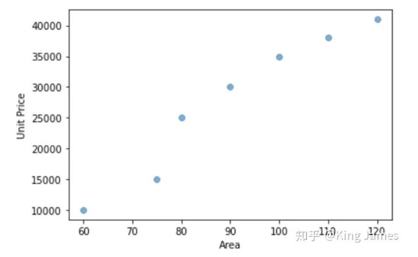

我们现在想拟合一个线性函数来表示房屋面积和房价的关系。我们初中都学过的一元一次函数表达式为：y=kx+b（k≠0）。很明显不可能有一对组合(k,b)全部经过上图7个点，我们只能尽可能地找到一对组合，使得该线性函数离上图7个点的总距离最近。

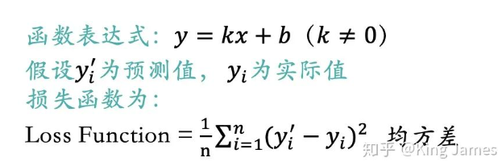

如上图所示，实际值与预测值之间差异的均方差我们把它称为损失函数，也有叫做成本函数或者代价函数的，意义都一样。我们希望找到一个组合（k，b）可以使得损失函数的值最小。上述只有一个输入变量x，如果我们多加入几个输入变量，比如卧室的数量、离最近地铁站的距离。最终目标变量和损失函数我们用下述函数表达式来表达：
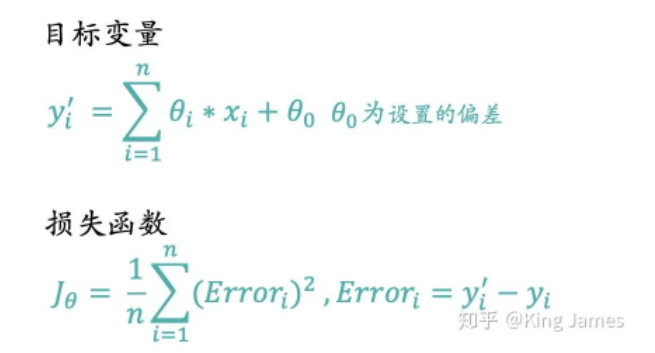

现在我们的任务就是求出一组θ，在已知【x，y】的前提下使得损失函数的值最小。那么如何计算出θ了，使用什么方法？

我们首先回到损失函数表达式本身，损失函数本身是一个y=x^2的形式，高中数学大家应该都学过这是一个开口向上的抛物线方程，大概长下图这样：

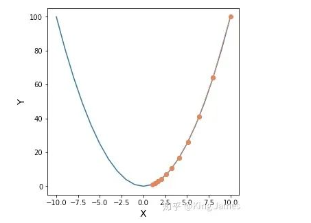

我们如何找到这个函数的最低点？上图是一个二维图，我们很轻松就可以肉眼看出x=0时，y最小。如果维度更多，比如z = (x-10)^2 + (y-10)^2，则得到下图：

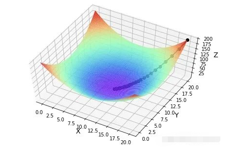

我们如何定位出最小值，特别强调一点，这里的x是一个“大”参数的概念，x应该等于下述公式

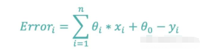

**大家要明确上图横坐标是x和y，函数表达式里的θ已经知道了，所以我们是找到最合适的（x,y）使得函数值最小。如果我们现在是已知样本（x,y），那么上图的变量就变为了θ_0和θ_i，并不是x_i，我们是以θ_0和θ_i作为输入变量做的图，x_i和y_i都是已知的固定值，这一点必须明确了。上图的纵坐标的值就变为损失函数的值。**

我们的问题是已知样本的坐标（x,y），来求解一组θ参数，使得损失函数的值最小。我们如何找到上图中的最低点？因为找到最低点，那么最低点对应的横坐标所有维度就是我们想得到的θ_0和θ_i，而纵坐标就是损失函数的最小值。找到最低点所有答案就全部解出来了。

现在问题来了： **有没有一种算法让我们可以慢慢定位出最小值？** 这个算法就是梯度下降法。

## 2. 梯度下降法简介

### 2.1 梯度下降法的思想

我们首先介绍梯度下降法的整体思想。假设你现在站在某个山峰的峰顶，你要在天黑前到达山峰的最低点，那里有食品水源供给站，可以进行能量补充。你不需要考虑下山的安全性，即使选择最陡峭的悬崖下山，你也可以全身而退，那么如何下山最快？

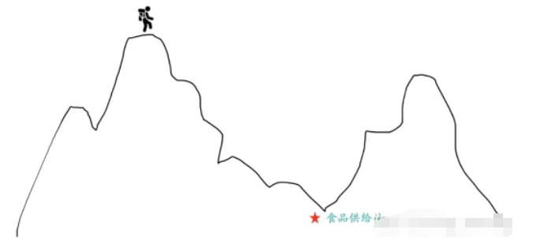

最快的方法就是以当前的位置为基准，寻找该位置最陡峭的地方，然后沿该方向往下走。走一段距离后，再以当前位置为基准，重新寻找最陡峭的地方，一直重复最终我们就可以到达最低点。我们需要不停地去重新定位最陡峭的地方，这样才不会限于局部最优。

那么整个下山过程中我们会面临两个问题：

* 如何测量山峰的“陡峭”程度；
* 每一次走多长距离后重新进行陡峭程度测量；走太长，那么整体的测量次数就会比较少，可能会导致走的并不是最佳路线，错过了最低点。走太短，测量次数过于频繁，整体耗时太长，还没有到达食品供给站就已经GG了。这里的步长如何设置？

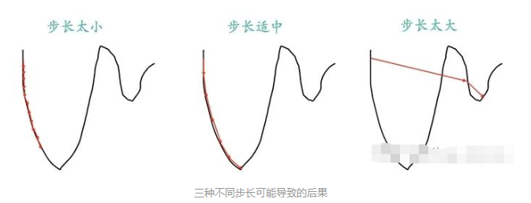

Part1里面介绍了如何从一个开口向上的抛物线高点定位到最低点的问题，这个和下山的场景是完全类似的。

抛物线就相当于一个山峰，我们的目标就是找到抛物线的最低点，也就是山底。最快的下山方式就是找到当前位置最陡峭的方向，然后沿着此方向向下走，对应到抛物线中，就是计算给定点的梯度，然后朝着梯度相反的方向（ Part 2.3里面会解释为什么是朝着梯度相反的方向），就能让抛物线值下降的最快。同时我们也要和下山一样，不停地定位新位置，再计算新位置的梯度，然后按照新方向下降，最后慢慢定位到抛物线的最低点。

### 2.2 梯度下降法算法

Part2.1里面已经介绍了梯度下降法的思想，遗留了两个问题。第一就是如何计算“陡峭”程度，我们这里把它叫做梯度，我们用∇J_θ来代替。第二个也就是步长问题，我们用一个α学习率来代表这个步长，α越大代表步长越大。知道了这两个值，我们如何去得到θ参数的更新表达式？

J是关于θ的一个函数，假设初始时我们在θ_1这个位置，要从这个点走到J的最小值点，也就是山底。首先我们先确定前进的方向，也就是梯度的反向“-∇J_θ”，然后走一段距离的步长，也就是α，走完这个段步长，就到达了θ_2这个点了。表达式如下图：

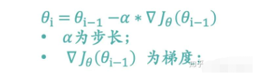

我们按照上述表达式一直不停地更新θ的值，一直到θ收敛不变为止，当我们到达山底，此时函数的梯度就是0了，θ值也就不会再更新了，因为表达式的后半部分一直是0了。

整个下降过程中损失函数的值是一定在减少，但是我们想学习出来的参数值θ不一定一直在减小。因为我们需要找到损失函数最小时的坐标点，这个坐标点的坐标不一定是原点，很可能是（2，3）甚至是（4，6），我们找到的是最合适的θ值使得损失函数最小。下图我们用一个例子来进行说明：

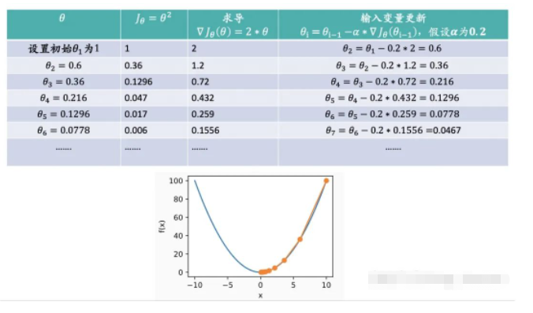

上图的最低点很明显就是原点，我们通过梯度下降法来逼近这个最低点。我们可以看到损失函数的值在一直减少，θ的值也在往0这个值进行收敛。

### 2.3 梯度下降法数学计算

Part2.1和2.2介绍了梯度下降的思想和θ更新的表达式，现在我们从数学层面进行解释：

* **为什么是向梯度相反的方向下降：**

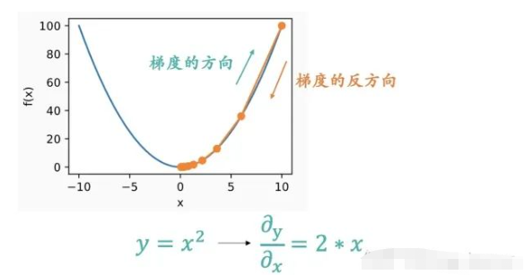

上图应该很形象地显示为什么要朝着梯度的反方向了。梯度是一个向量，梯度的方向是函数在指定点上升最快的方向，那么梯度的反方向自然是下降最快的方向了。

* **泛化的θ参数更新公式：**

Part2.2里面的例子我们选择的是一个最简单的函数表达式，θ参数分为两种，一种是和输入变量x配对的参数θ_i，一种是固定的偏差θ_0。我们用已知的样本数据（x,y）来求解出使得损失函数最小的一组θ参数。下面我们来计算一个通用泛化的θ参数更新表达式。**我们只需要用到高中数学中的导数知识即可，朋友们相信我真的很easy。**

下图是对和输入变量x配对的参数θ_i更新表达式：

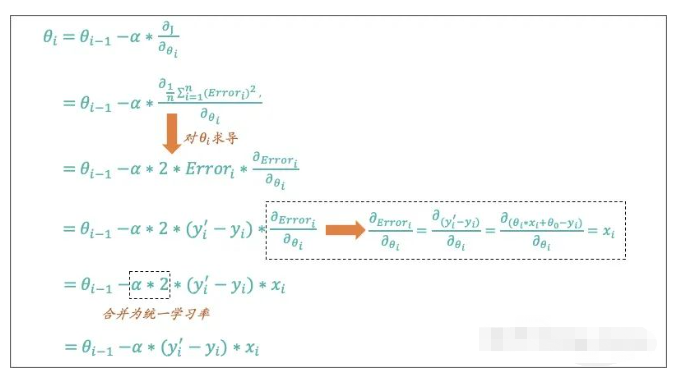

下图是对固定的偏差θ_0的更新表达式：

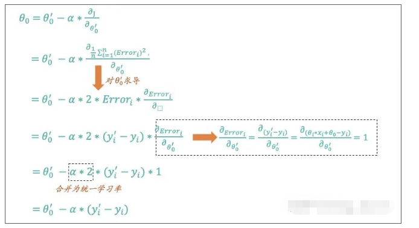

上面的数学过程也就是高中我们学习导数里面最简单的求导过程了。那么至此我们也就将梯度下降算法的思想和数学解释全部介绍完了。

### 2.4 梯度下降法分类

Part2.3里面的公式大家也看到了我们要借助样本的（x，y）的数据来进行参数θ的更新，如果现在样本有100条数据，我们如何来更新。正常情况下，我们更新的方式有两种：

* **随机梯度下降(Stochastic Gradient Descent)**

我们每次只使用单个训练样本来更新θ参数，依次遍历训练集，而不是一次更新中考虑所有的样本。就像开头介绍那7条房价数据，我们一个一个来计算，计算一次更新一次θ，直到θ收敛或者达到后期更新幅度已经小于我们设置的阀值。

* **批量梯度下降(Batch Gradient Descent)**

我们每次更新都遍历训练集中所有的样本，以它们的预测误差之和为依据更新。我们会一次性将7条样本数据的预测误差都汇总，然后进行一次更新。更新完以后，继续以7条样本数据的预测误差之和进行汇总，再更新，直到θ收敛或者达到后期更新幅度已经小于我们设置的阀值。

当训练样本数很大时，批量梯度下降的每次更新都会是计算量很大的操作，而随机梯度下降可以利用单个训练样本立即更新，因此随机梯度下降 通常是一个更快的方法。但随机梯度下降也有一个缺点，那就是θ可能不会收敛，而是在最小值附近振荡，但在实际中也都会得到一个足够好的近似。所以实际情况下，我们一般不用固定的学习率，而是让它随着算法的运行逐渐减小到零，也就是在接近“山底”的时候慢慢减小下降的“步幅”，换成用“小碎步”走，这样它就更容易收敛于全局最小值而不是围绕它振荡了。

## 3.  梯度下降法Python实践

以下代码全部使用Python3环境

### 3.1 单变量：y = x^2求最低点

```python
import matplotlib.pyplot as plt
import numpy as np
# fx的函数值
def fx(x):
    return x**2

#定义梯度下降算法
def gradient_descent():
    times = 10 # 迭代次数
    alpha = 0.1 # 学习率
    x =10# 设定x的初始值
    x_axis = np.linspace(-10, 10) #设定x轴的坐标系
    fig = plt.figure(1,figsize=(5,5)) #设定画布大小
    ax = fig.add_subplot(1,1,1) #设定画布内只有一个图
    ax.set_xlabel('X', fontsize=14)
    ax.set_ylabel('Y', fontsize=14)
    ax.plot(x_axis,fx(x_axis)) #作图
  
    for i in range(times):
        x1 = x  
        y1= fx(x)  
        print("第%d次迭代：x=%f，y=%f" % (i + 1, x, y1))
        x = x - alpha * 2 * x
        y = fx(x)
        ax.plot([x1,x], [y1,y], 'ko', lw=1, ls='-', color='coral')
    plt.show()

if __name__ == "__main__":
    gradient_descent()
```

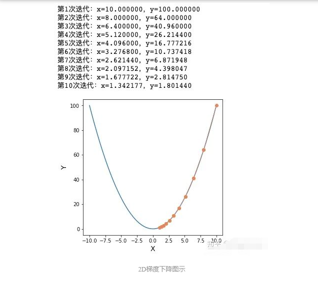

### 3.2 多变量求最低点

多变量：z = (x-10)^2 + (y-10)^2

```python
import matplotlib.pyplot as plt
import numpy as np
from mpl_toolkits.mplot3d import Axes3D
#求fx的函数值
def fx(x, y):
    return (x - 10) ** 2 + (y - 10) ** 2

def gradient_descent():
    times = 100 # 迭代次数
    alpha = 0.05 # 学习率
    x = 20 # x的初始值
    y = 20 # y的初始值

    fig = Axes3D(plt.figure()) # 将画布设置为3D
    axis_x = np.linspace(0, 20, 100)#设置X轴取值范围
    axis_y = np.linspace(0, 20, 100)#设置Y轴取值范围
    axis_x, axis_y = np.meshgrid(axis_x, axis_y) #将数据转化为网格数据
    z = fx(axis_x,axis_y)#计算Z轴数值
    fig.set_xlabel('X', fontsize=14)
    fig.set_ylabel('Y', fontsize=14)
    fig.set_zlabel('Z', fontsize=14)
    fig.view_init(elev=60,azim=300)#设置3D图的俯视角度，方便查看梯度下降曲线
    fig.plot_surface(axis_x, axis_y, z, rstride=1, cstride=1, cmap=plt.get_cmap('rainbow')) #作出底图
  
    for i in range(times):
        x1 = x  
        y1 = y   
        f1 = fx(x, y)  
        print("第%d次迭代：x=%f，y=%f，fxy=%f" % (i + 1, x, y, f1))
        x = x - alpha * 2 * (x - 10)
        y = y - alpha * 2 * (y - 10)
        f = fx(x, y)
        fig.plot([x1, x], [y1, y], [f1, f], 'ko', lw=2, ls='-')
    plt.show()

if __name__ == "__main__":
    gradient_descent()
```

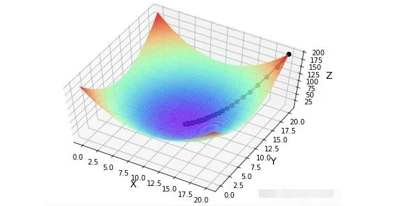

### 3.3 根据给定样本求解出最佳θ组合

```python
import numpy as np
import matplotlib.pyplot as plt   
#样本数据
x = [1,2,3,4,5,6,7,8,9,10,11,12,13,14,15,16,17,18,19,20]
y = [3,4,5,5,2,4,7,8,11,8,10,11,13,13,16,17,16,17,18,20]
m = 20 #样本数量
alpha = 0.01#学习率
θ_0 = 1 #初始化θ_0的值
θ_1 = 1 #初始化θ_1的值

#预测目标变量y的值
def predict(θ_0,θ_1, x):
    y_predicted = θ_0 + θ_1*x
    return y_predicted

#遍历整个样本数据，计算偏差，使用批量梯度下降法
def loop(m,θ_0,θ_1,x,y):
    sum1 = 0
    sum2 = 0
    error = 0
    for i in range(m):
        a = predict(θ_0,θ_1, x[i]) - y[i]
        b = (predict(θ_0,θ_1, x[i]) - y[i])* x[i]
        error1 = a*a
        sum1 = sum1 + a
        sum2 = sum2 + b
        error = error + error1
    return sum1,sum2,error

#批量梯度下降法进行更新θ的值
def batch_gradient_descent(x, y,θ_0,θ_1, alpha,m):
    gradient_1 = (loop(m,θ_0,θ_1,x,y)[1]/m)
    while abs(gradient_1) > 0.001:#设定一个阀值，当梯度的绝对值小于0.001时即不再更新了
        gradient_0 = (loop(m,θ_0,θ_1,x,y)[0]/m)
        gradient_1 = (loop(m,θ_0,θ_1,x,y)[1]/m)
        error = (loop(m,θ_0,θ_1,x,y)[2]/m)
        θ_0 = θ_0 - alpha*gradient_0
        θ_1 = θ_1 - alpha*gradient_1
    return(θ_0,θ_1,error)

θ_0 = batch_gradient_descent(x, y,θ_0,θ_1, alpha,m)[0]
θ_1 = batch_gradient_descent(x, y,θ_0,θ_1, alpha,m)[1]
error = batch_gradient_descent(x, y,θ_0,θ_1, alpha,m)[2]
print ("The θ_0 is %f, The θ_1 is %f, The The Mean Squared Error is %f " %(θ_0,θ_1,error))

plt.figure(figsize=(6, 4))# 新建一个画布
plt.scatter(x, y, label='y')# 绘制样本散点图
plt.xlim(0, 21)# x轴范围
plt.ylim(0, 22)# y轴范围
plt.xlabel('x', fontsize=20)# x轴标签
plt.ylabel('y', fontsize=20)# y轴标签

x = np.array(x)
y_predict = np.array(θ_0 + θ_1*x)
plt.plot(x,y_predict,color = 'red')#绘制拟合的函数图
plt.show()
```

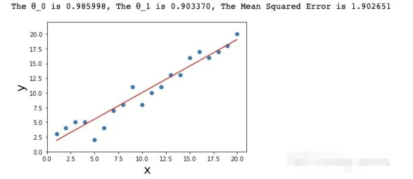

本篇文章前半部分通俗易懂地将整个梯度下降算法全面地讲解了一遍，后半部分通过Python将整个算法实现了一遍
